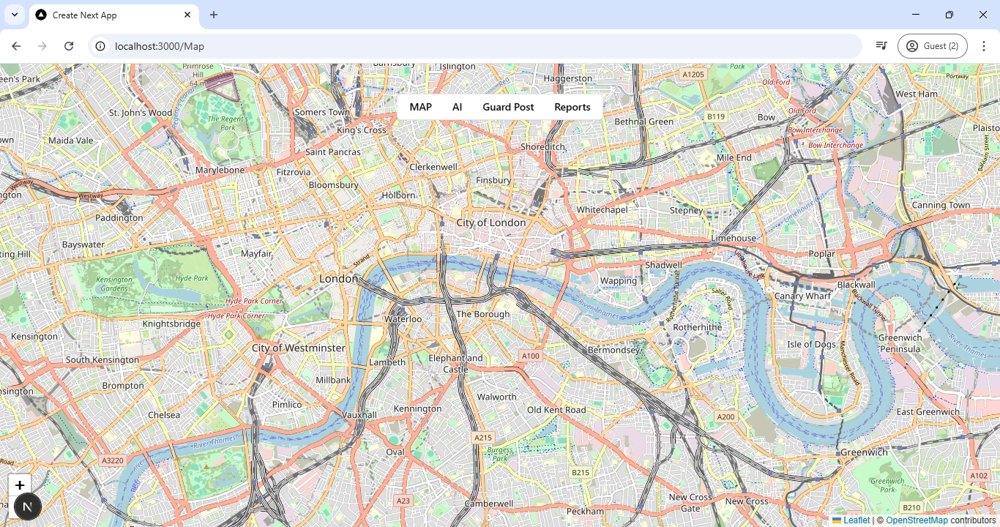
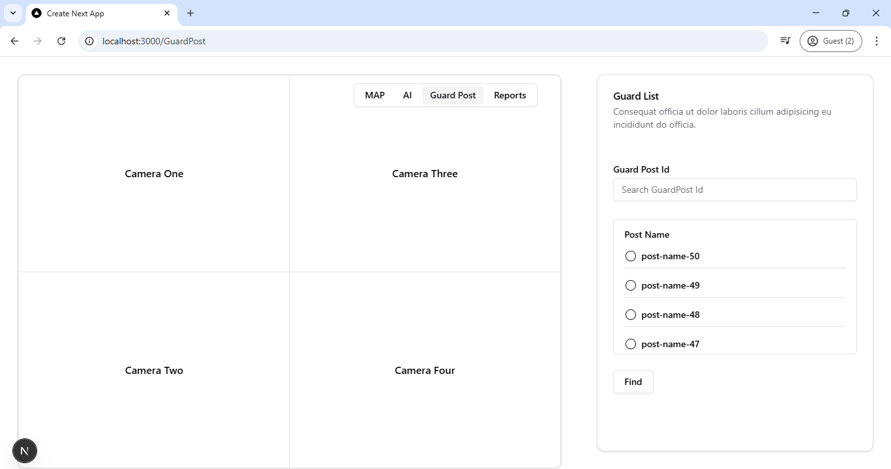
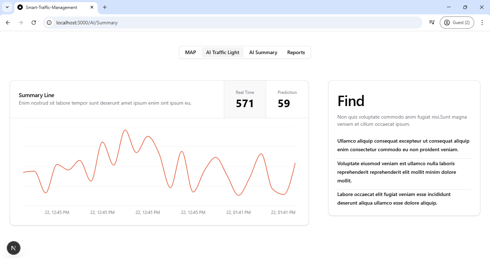
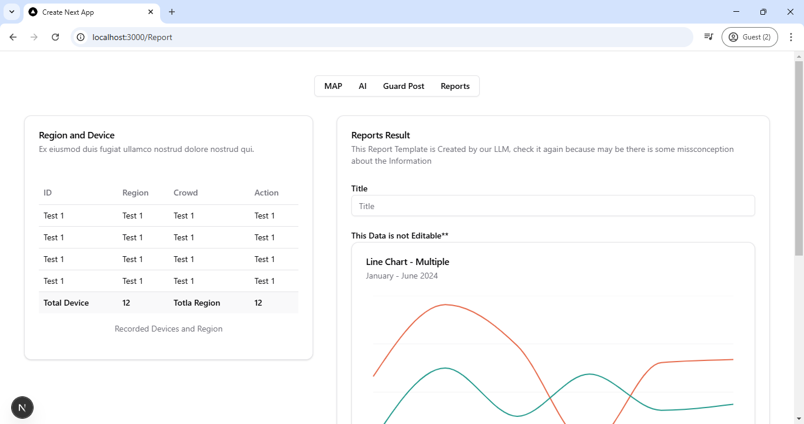

# 🚦 Smart Traffic Management Frontend

## Deskripsi Singkat
Smart Traffic Management Frontend adalah antarmuka pengguna untuk **Smart Traffic Management System**. Aplikasi ini menyediakan tampilan interaktif bagi pengguna untuk memantau dan mengelola lalu lintas secara real-time dengan memanfaatkan AI.

## Tech
- **Next.js** – Library untuk membangun antarmuka pengguna yang responsif.
- **Tailwind CSS** – Framework styling untuk tampilan yang modern dan fleksibel.
- **Leaflet.js** – Library untuk peta interaktif.

## ✨ Pages
- 🌍 **Map** – Menampilkan post guard dan dapat memantau kondisi lalu lintas.

- 📌 **Post Guard** – Menyajikan data lalu lintas secara real-time melalui visualisasi grafik.

- 🚦 **AI | Trafic Light** – Memungkinkan operator untuk mengatur lampu lalu lintas secara manual atau otomatis.

- 📊 **AI | Summary** – Menyediakan histori dan analisis pola lalu lintas untuk perencanaan yang lebih baik.

- 🔔 **Reports** – Membuat reports dari keadaan lalu lintas.

